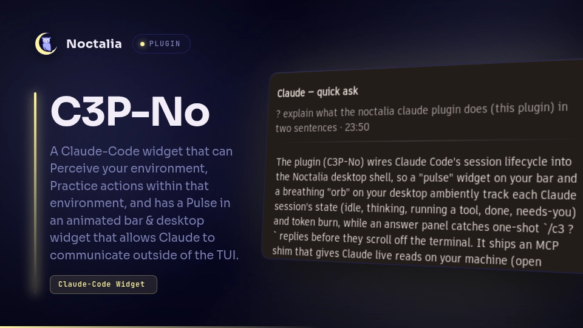
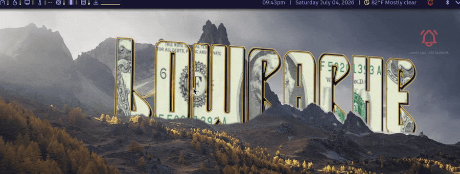

<p align="center">
  
</p>

## Claude Code Companion for Noctalia v5 - C3P-No 

> **C**laude · **P**erceive · **P**ractice · **P**ulse · **No**ctalia → C3P-No

   

**What it is:** a noctalia v5 plugin that puts [Claude Code](https://claude.com/claude-code)'s live status on your desktop — a **pulse** on the bar, a breathing **orb** on the desktop, and an **answer panel** for quick questions.
**Who it's for:** you run Claude Code (Anthropic's terminal AI agent) on a noctalia desktop. Don't run Claude Code? The signal bus is agent-agnostic — see [Wiring up other agents](#wiring-up-other-agents).

Claude Code is a brilliant agent trapped in a text box. It can't see the windows you have open, can't tap you on the shoulder when it hits a wall, and gives you nothing to glance at while it churns. So you sit there watching a terminal, or you wander off and miss the moment it needed you.

This plugin gives it a body. It wires noctalia into Claude's lifecycle so a **pulse** on your bar tracks every session, an **orb** on your desktop breathes along with the work, and an **answer panel** catches one-shot replies before they scroll away. The terminal keeps doing the actual thinking — permissions, tools, MCP, all native. This is just the nervous system that lets the rest of your desktop feel it.

Built and live-tested against noctalia 5.0.0 (flake input `623210223c`), with 84 offline widget checks to keep the state machine honest.

---

## See it

<p align="center">
  <br>
  <em>One session, start to finish: the <strong>pulse</strong> on the bar and the <strong>orb</strong> on the desktop breathe through idle, thinking, a tool run, done, and needs-you.</em>
</p>

<p align="center">
  <br>
  <em>Ask something quick with <code>/c3 ?</code> and the whole answer waits for you in the panel, instead of scrolling off the top of the terminal.</em>
</p>

---

## The three P's of C3P-No

**Perceive.** `shim/noctalia-mcp.py` is a stdio MCP shim that hands Claude a live read on your machine: `niri msg -j` for the windows you have open, `playerctl` for what's playing, `noctalia msg status` for the state of the shell itself. Nothing to wire up by hand. Launch through `/c3` and it attaches itself.

**Practice.** Everything on the backend funnels through `c3.luau`, the `/c3` launcher and the one door in. It normalizes the event vocabulary, throws `notify-send` toasts, and calls `noctalia msg` to move panels around. One chokepoint on purpose — so when something acts up, there's exactly one place to go look.

**Pulse.** `pulse.luau` sits on your bar and runs the show. Hook events land here over IPC, and from there it does the rest: tracks every session at once, surfaces whichever one's most urgent, breathes in your accent color, and mirrors the rollup into `noctalia.state` under `c3.pulse` for anyone downstream to read.

And downstream is where the quiet parts live. `orb.luau` is pure view. It subscribes to `c3.pulse` and breathes the same state frame by frame, glyph and opacity riding a sine wave, tempo picking up as things get urgent — no hooks, no logic of its own, just a reflection. `answer.luau` is the `[[panel]]` that catches a `/c3 ?` reply and holds the whole thing: wrapped, scrollable, all the parts a toast lops off the end.

---

## Requirements

- **noctalia 5.0.0** on niri (Wayland)
- **[Claude Code](https://claude.com/claude-code)** — the agent being visualized. Optional if you're driving the widgets from another agent via [PROTOCOL.md](PROTOCOL.md).
- **Python 3** for the MCP shim (stdlib only, no pip installs)
- On the PATH as the shim's senses need them: `niri`, `playerctl`, `nmcli`, `notify-send`

## Install

```sh
# clone and symlink into the plugins dir
ln -s "$PWD" ~/.local/share/noctalia/plugins/c3p-no

# enable the plugin
noctalia msg plugins enable lowcache/c3p-no
```

Then, in order:

1. **Put the `pulse` widget on a bar** (Settings → Bar). Read the warning below first — this one isn't optional.
2. Add the `orb` desktop widget if you want the ambient presence.
3. Merge `hooks/settings.snippet.json` into `~/.claude/settings.json` so Claude's lifecycle hooks actually drive the pulse.
4. Point Claude at `shim/noctalia-mcp.py` with `--mcp-config` to hand it the senses and hands. (Sessions you launch through `/c3` do this for you.)

Prove it works:

```sh
noctalia msg plugin lowcache/c3p-no:pulse all needs_attention   # bar icon → red bell
noctalia msg plugin lowcache/c3p-no:pulse all idle              # back to robot
```

> [!WARNING]
> **`pulse` has to stay on a bar.** It's the sole aggregator — the one piece that hears the hooks and publishes the state everything else reads. Noctalia only runs bar widgets while they're placed on a bar, so the moment you pull `pulse` off, the plugin goes dark. The hooks keep firing into the void, the orb freezes on its last breath, and IPC pokes do nothing. If that happens, the fix is always the same: put `pulse` back on a bar.

---

## Living with it

`/c3 <task>` opens a real Claude Code session in your terminal, shim already wired in. Bare `/c3` picks up where you left off (`claude --continue`). And `/c3 ? <question>` is the quick one — a read-only ask that comes back as a toast and lands, in full, in the answer panel.

That panel opens however you like it: click the pulse, use the "Show last answer" row under `/c3`, or run `noctalia msg panel-open lowcache/c3p-no:answer`. Leave it open and it refreshes live while suppressing the toast, so you're never reading the same answer twice. A click outside or Esc puts it away.

Hover the bar and the tooltip tells you where each session stands and what it's burning — input, output, cache reads. Run a few at once and you get a line per session plus a Σ total, with the icon always showing whichever one needs you most.

---

## Wiring up other agents

None of this is Claude-specific under the hood. The pulse speaks a plain event format and doesn't care who's talking — any agent, CI job, or shell script that can run a command on its own lifecycle can light up the same bar. [PROTOCOL.md](PROTOCOL.md) has the full eight-event vocabulary, the CSV payload, session semantics, and the adapter contract. The reference emitter, `hooks/pulse-emit`, is plain POSIX sh and needs nothing but `noctalia` on your PATH:

```sh
hooks/pulse-emit turn_start mysess
hooks/pulse-emit turn_end mysess gpt-5 12000 800
hooks/pulse-emit session_end mysess
```

---

## Rough edges

A few things worth knowing before they surprise you:

- Plugin panels render at `Layer::Top`, so an overlay window — a notification, a quake terminal, a polkit prompt — can sit on top of the answer panel. The answer's still there; clear the overlay and you'll see it. There's an upstream ask in for panel layer control.
- Bar widgets don't fire `state.watch` callbacks in noctalia 5.0.0, so the plugin polls instead. Eight-digit hex alpha is ignored too — brightness is done by scaling RGB.
- Builtin and wallpaper-generated palettes have no on-disk JSON, so those fall back to fixed accent colors. Custom and community palettes are followed live, rechecked every ~8 s.
- Quick-ask rides headless `claude -p`, which doesn't refresh an expired OAuth login token — only an interactive session does ([upstream](https://github.com/anthropics/claude-code/issues/53063)). The plugin checks the token's expiry before launching and, instead of burning the request on a guaranteed 401, tells you to open a terminal Claude session first; a failure it couldn't predict gets the same message in place of the raw API error.
- The MCP shim is a Python prototype. A compiled port is the intended endgame.
- The shim's memory tool drops notes into `~/.memory/inbox` for the memd curator to pick up. No memd, no reader — the files get written and simply sit there. It follows memd's Inbox Protocol v1.0 (`INBOX-PROTOCOL.md` in the memd repo).

---

## Development

`nix/` is a self-contained luau toolchain for exercising the widget logic offline — no noctalia reload to catch a regression in the state machine, the token-burn tooltip, the orb's breath math, or the answer panel's render guard.

```sh
nix run ./nix#test      # every widget suite
nix run ./nix#pulse     # bar widget only
nix run ./nix#orb       # presence orb only
nix run ./nix#answer    # answer panel only
nix develop ./nix       # shell with luau
```

Each runner stitches together a stub prelude (the `barWidget` / `desktopWidget` / `ui` / `noctalia` API surface), the real widget source, and its spec, then runs the whole thing under `luau` and asserts on what the stubs recorded. The specs test the shipping source, not a copy of it — 84 checks in all: 38 on pulse, 26 on orb, 20 on the answer panel.

---

## License

MIT — see [LICENSE](LICENSE).
