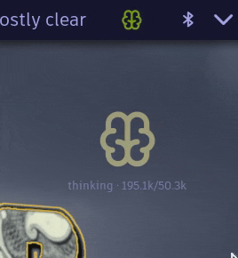
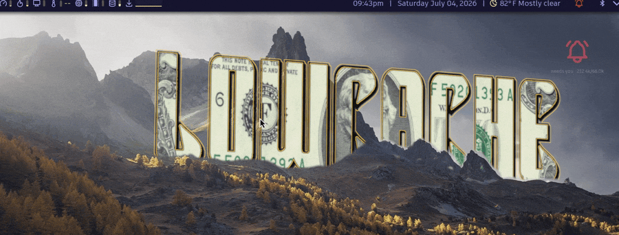

# Claude Companion


A Noctalia v5 plugin that puts [Claude Code](https://claude.com/claude-code)'s live status on your desktop — a **pulse** on the bar, a breathing **orb** on the desktop, and an **answer panel** for quick questions.

  

Claude Code is a brilliant agent trapped in a text box. It can't see the windows you have open, can't tap you on the shoulder when it hits a wall, and gives you nothing to glance at while it churns. So you sit there watching a terminal, or you wander off and miss the moment it needed you.

This plugin gives it a body. It wires Noctalia into Claude's lifecycle so a **pulse** on your bar tracks every session, an **orb** on your desktop breathes along with the work, and an **answer panel** catches one-shot replies before they scroll away. The terminal keeps doing the actual thinking — permissions, tools, MCP, all native. This is just the nervous system that lets the rest of your desktop feel it.

Don't run Claude Code? The signal bus is agent-agnostic — any agent, CI job, or shell script that can run a command on its own lifecycle can light up the same bar. See [Wiring up other agents](#wiring-up-other-agents).

## Plugin

| Field | Value |
| --- | --- |
| ID | `lowcache/claude-companion` |
| Entries | Services: `pulse-svc`, `claude-ask`; bar widget: `pulse`; desktop widget: `orb`; panels: `answer`, `sessions`, `consent`, `ask`; launcher: `claude` |
| Launcher Prefix | `/claude` |

Built and live-tested against Noctalia 5.0.0 (build `623210223c`), with an offline widget spec suite keeping the state machine honest.

## See it



One session, start to finish: the **pulse** on the bar and the **orb** on the desktop breathe through idle, thinking, a tool run, done, and needs-you.



Ask something quick with `/claude ?` and the whole answer waits for you in the panel, instead of scrolling off the top of the terminal.

## How it works

**Perceive.** `shim/noctalia-mcp.py` is a stdio MCP shim that hands Claude a live read on your machine: `niri msg -j` for the windows you have open, `playerctl` for what's playing, `noctalia msg status` for the state of the shell itself. Nothing to wire up by hand. Launch through `/claude` and it attaches itself.

**Practice.** Everything on the backend funnels through `claude.luau`, the `/claude` launcher and the one door in. It normalizes the event vocabulary and calls `noctalia msg` to move panels around. One chokepoint on purpose — so when something acts up, there's exactly one place to go look. That file is registered twice: as the `/claude` launcher, and as a `[[service]]` under `claude-ask`. A launcher entry can't receive IPC, so the ask panel's poke needs the second registration to have somewhere to land — same file either way, so the read-only flags for a quick-ask still live in exactly one place.

**Pulse.** `pulse-svc.luau` is a headless `[[service]]` that runs the show. Hook events land here over IPC at `lowcache/claude-companion:pulse-svc`, and from there it does the rest: tracks every session at once, surfaces whichever one's most urgent, and publishes a rollup to shared state under `claude.pulse` for subscribers to read.

And downstream is where the surfaces live. `pulse.luau` on the bar and `orb.luau` on the desktop are independent subscribers that only render. Both watch `claude.pulse` — `pulse.luau` breathes the accent color and shows per-session tooltips, while `orb.luau` breathes the same state frame by frame, glyph and opacity riding a sine wave, tempo picking up as things get urgent. Neither holds hooks or logic of its own. `answer.luau` is the `answer` panel that catches a `/claude ?` reply and holds the whole thing: wrapped, scrollable, all the parts a toast lops off the end.

## Requirements

- **Noctalia 5.0.0** on a supported Wayland compositor — **niri**, **Hyprland**, or **Sway**. The shim detects which one is running and speaks its IPC; the widgets themselves are compositor-agnostic. You only need the CLI for the compositor you actually run — `niri`, `hyprctl` (Hyprland), or `swaymsg` (Sway) — not all three.
- **[Claude Code](https://claude.com/claude-code)** — the `claude` agent being visualized. Optional if you're driving the widgets from another agent via [PROTOCOL.md](PROTOCOL.md).
- **`python3`** for the MCP shim (stdlib only, no pip installs)
- On the PATH as the shim's senses need them: `playerctl`, `nmcli`, `notify-send`, `ps`
- For the generic shell adapter (`hooks/pulse-emit`, only used when driving the widgets from a non-Claude agent): `tr` is required; `timeout` is optional — the adapter falls back to a direct dispatch when it's absent.

## Install

```sh
# clone and symlink into the plugins dir
ln -s "$PWD" ~/.local/share/noctalia/plugins/claude-companion

# enable the plugin
noctalia msg plugins enable lowcache/claude-companion
```

Then, in order:

1. **(Optional) Put the `pulse` widget on a bar** (Settings → Bar) for the glanceable dot — capture no longer depends on it; the headless `pulse-svc` service does the listening.
2. Add the `orb` desktop widget if you want the ambient presence.
3. Wire Claude's lifecycle hooks — your sessions already show up without them ([Sessions without hooks](#sessions-without-hooks)), but hooks add tool-level detail, token burn and the consent gate, and land instantly. One command, run from wherever the plugin landed:

   ```sh
   # catalog install
   python3 ~/.local/state/noctalia/plugins/materialized/community/claude-companion/hooks/install.py
   # dev symlink (above)
   python3 ~/.local/share/noctalia/plugins/claude-companion/hooks/install.py
   ```

   It adds the hooks to `~/.claude/settings.json` (backing it up first), repairs stale paths left by an older install, and leaves every other hook alone; run it again and it changes nothing. `--check` only reports. You don't have to remember any of that: the sessions panel runs the check each time it opens and offers a one-click **Repair** when something's off. Prefer to merge by hand? `hooks/settings.snippet.json` has the same entries.
4. Point Claude at `shim/noctalia-mcp.py` with `--mcp-config` to hand it the senses and hands. (Sessions you launch through `/claude` do this for you.)
5. (Optional) Turn on the consent gate — see [Approving tools from the desktop](#approving-tools-from-the-desktop). It ships off; the hook in step 3 is inert until you set `consent_mode`.

Prove it works:

```sh
noctalia msg plugin lowcache/claude-companion:pulse-svc all needs_attention   # bar icon → red bell
noctalia msg plugin lowcache/claude-companion:pulse-svc all idle              # back to robot
```

> [!WARNING]
> **`pulse` no longer has to stay on a bar.** The sole aggregator is now the headless `pulse-svc` service, which starts with the shell and listens whether or not any widget is placed — so pulling the `pulse` dot off a bar just hides the glanceable icon; the orb keeps updating and hooks/IPC still land. This retires the old **D10** requirement, made possible by the `[[service]]` entry kind added in the Noctalia 5 beta.

## Usage

`/claude <task>` opens a real Claude Code session in your terminal, shim already wired in. Bare `/claude` picks up where you left off (`claude --continue`). And `/claude ? <question>` is the quick one — a read-only ask whose answer opens, in full, in the answer panel.

That panel opens on its own when the answer lands. To bring it back later, use the "Show last answer" row under `/claude`, or toggle it from the CLI:

```sh
noctalia msg panel-toggle lowcache/claude-companion:answer
```

Leave it open and it refreshes live with the next answer. A click outside or Esc puts it away.

Hover the bar and the tooltip tells you where each session stands and what it's burning — input, output, cache reads. Run a few at once and you get a line per session plus a Σ total, with the icon always showing whichever one needs you most.

**Click the pulse** to ask a one-off question without the launcher. Type, press Enter, done — no `/claude`, no `?` prefix to remember. It runs the same read-only quick-ask path as `/claude ? …`, and the answer arrives the same way, in the answer panel.

```sh
noctalia msg panel-toggle lowcache/claude-companion:ask
```

### Sessions without hooks

The pulse works before you've wired a single hook. Every five seconds `pulse-svc` reads the per-process session files Claude Code keeps in `~/.claude/sessions/` (or `$CLAUDE_CONFIG_DIR/sessions/`) and lists each interactive session as working, **waiting on you** (a permission prompt or a question), or idle. It checks that each file's process is still alive and started when the file says, because a killed Claude leaves its file behind. Headless runs — `claude -p`, SDK scripts, the plugin's own quick-asks — are skipped.

Hooks layer on top: the moment one fires for a session, it takes over with tool-level states and token burn. The two keep each other honest, though — whichever signal is newer wins. Claude Code runs no hook when you interrupt it with Esc, or while a question sits waiting for your answer, so a hooked session could stay stuck at working; when the session file changes after the last hook, the pulse follows the file instead (within five seconds). A session the pulse only knows by detection says **no hooks** in the sessions panel. Those files are Claude Code internals rather than a documented interface, so if a future release changes them, detection quietly finds nothing and hooks keep working. Turn it off with the `detect_sessions` setting.

**Right-click the pulse** for the sessions panel — the same rollup, but you can act on it. A tooltip disappears on the way to it; this doesn't. One row per live session with its state, model and burn, and a **Retire** button on each.

You'll rarely need Retire. A Claude session that exits without its `SessionEnd` hook firing — terminal killed, crash, hook interrupted mid-distill — retires itself within about five seconds: the hooks report which Claude process they belong to, and the service notices when that process is gone. Retire is for what that can't see: sessions from older hooks, or an adapter that doesn't send a process id. It adds no new protocol: a retire is the ordinary `session_end` event carrying that session's id, exactly what `hooks/pulse.py` sends.

```sh
noctalia msg panel-toggle lowcache/claude-companion:sessions
```

## Settings

The plugin declares five user settings, read via `noctalia.getConfig(<key>)`:

| Setting | Type | Range | Step | Default | Description |
| --- | --- | --- | --- | --- | --- |
| `breath_speed` | double | 0.25–3.0 | 0.05 | 1.0 | Phase-rate multiplier for the breathing animation on both the bar dot and the desktop orb. Higher = faster. |
| `pulse_glow_floor` | double | 0.0–0.9 | 0.05 | 0.45 | How dim the bar dot gets at the trough of its breath. 0 = dims to black, higher = stays brighter. |
| `orb_swell` | double | 0.0–3.0 | 0.05 | 1.0 | How far the desktop orb glyph magnifies as it breathes. 0 = static size, higher = a bigger swing. |
| `consent_mode` | select | off / learn / enforce | — | `off` | The tool-consent gate. See [Approving tools from the desktop](#approving-tools-from-the-desktop). |
| `detect_sessions` | bool | — | — | on | Show running Claude sessions without hooks, from Claude Code's own session files. See [Sessions without hooks](#sessions-without-hooks). |

There are no color settings — both surfaces follow the active theme palette via accent role names (`secondary`, `primary`, `error`).

## Approving tools from the desktop

Everything above is observation: the pulse tells you Claude is blocked, and you go
find the terminal. The **consent gate** closes that loop — Claude asks, you answer on
the desktop, and the tool runs or doesn't. You never leave what you were doing.

It is **off by default** and should stay off until you have read this section, because
unlike the rest of the plugin it sits in the critical path of a tool call.

Set `consent_mode` in the plugin's settings:

| Mode | What happens |
| --- | --- |
| `off` | The hook exits immediately. Identical to not having it installed. |
| `learn` | Records what Claude runs. Never blocks, never prompts. |
| `enforce` | Anything not already allowlisted opens the consent panel and waits. |

**Start in `learn` for a few days of normal work.** It writes one line per gated tool
call to `$XDG_STATE_HOME/noctalia/claude-companion/learn.jsonl`, which is how the
allowlist gets seeded from traffic you actually produce instead of from anyone's
guess about what is safe. It sits beside the allowlist in durable state, not on the
runtime tmpfs, so a multi-day run survives the logouts it will certainly span.
When it has seen enough:

```sh
python3 hooks/consent.py promote   # fold every observed command into the allowlist
```

`promote` is CLI-only and has no surface in the shell, so switching `consent_mode`
straight from `learn` to `enforce` in the settings skips it — and every command you
have ever run then stops to ask. Run it first.

Then switch to `enforce`. **What the allowlist buys you is that those commands stop
opening the panel** — it is not a grant of permission. The hook returns no decision
for them, so Claude Code applies its own permission rules exactly as it would
without this plugin. The gate can add a prompt; it never removes one.

**What gets gated.** Only the mutating tools — the matcher in
`hooks/settings.snippet.json` is `^(Bash|Write|Edit|NotebookEdit)$`. Reads, greps and
globs are never gated and never invoke the hook at all. Widen or narrow it by editing
that matcher; it is your `settings.json`, not the plugin's.

**The panel** leads with the thing being authorised — the command, or for a path tool
the path *and the content it would write* — because the description below it and the
"Claude says" line are both written by the model whose action you are approving, and
neither should caption it from above. Anything too long to fit is clipped with an
explicit marker rather than silently cut. The presence line appears only while a single
session is running, since it carries no session id and could otherwise describe a
different session's work. Then the cwd and session.

Note that **Always allow** on a `Write` or `Edit` keys on the *path*, not the content:
you are approving "Claude may write this file", and a later write of different bytes to
the same path will not ask again. Bash keys on the exact command string, so it has no
such reach. Three answers: **Allow once**, **Always
allow** (appends to the allowlist), **Deny**. It opens itself when a request arrives and
closes when you answer; opening it by hand shows whatever is pending, or an empty state
when nothing is:

```sh
noctalia msg panel-toggle lowcache/claude-companion:consent
```

**Nothing here classifies anything.** The allowlist ships empty and only ever grows by
your explicit click, keyed on the *exact* command string. There is no pattern matching
and no shipped safelist, because a pattern is a security policy and shell composition
(`git status && rm -rf ~`) defeats one in a single line.

**If anything goes wrong, the gate gets out of the way.** Printing nothing is Claude
Code's "no decision, proceed normally", and every failure route takes it: Noctalia
offline (detected on dispatch, so it fails fast rather than waiting), no answer inside
the hook's 110s deadline, a response that doesn't echo the request nonce, a malformed
payload, an unhandled exception. In all of them Claude Code asks in the terminal
exactly as it did before. `tests/consent_spec.py` pins every one of those paths.

**Forgery.** Requests and responses live in `$XDG_RUNTIME_DIR` (0700, tmpfs, per-user)
at 0600, and each response must echo a nonce from its request. Without
`XDG_RUNTIME_DIR` the gate disables itself rather than fall back to a world-writable
`/tmp`, where any local process could drop an `allow` of its own.

> [!NOTE]
> The allowlist lives at `$XDG_STATE_HOME/noctalia/claude-companion/allow.jsonl` and is
> meant to persist. On an impermanent root, make sure that path is on your persist list
> or you will re-approve everything after each boot.

## IPC

Every entry id, and the exact command that reaches it. The plugin id is
`lowcache/claude-companion`; the part after the `:` is the entry id from `plugin.toml`.

Panels — `answer`, `sessions`, `consent`, `ask`:

```sh
noctalia msg panel-toggle lowcache/claude-companion:answer
noctalia msg panel-toggle lowcache/claude-companion:sessions
noctalia msg panel-toggle lowcache/claude-companion:consent
noctalia msg panel-toggle lowcache/claude-companion:ask
```

The pulse aggregator service — `pulse-svc`. Eight lifecycle events plus three control
events; payload is a single space-free CSV. Full contract in [PROTOCOL.md](PROTOCOL.md):

```sh
noctalia msg plugin lowcache/claude-companion:pulse-svc all <event> [payload]
noctalia msg plugin lowcache/claude-companion:pulse-svc all needs_attention   # bar icon -> red bell
noctalia msg plugin lowcache/claude-companion:pulse-svc all idle              # back to robot
```

The quick-ask backend service — `claude-ask`. A bare poke; the question is written to
`$XDG_RUNTIME_DIR/claude-companion/ask` first, because a payload cannot contain spaces:

```sh
noctalia msg plugin lowcache/claude-companion:claude-ask all ask
```

Launcher provider — id `claude`, **prefix `claude`**. Type `claude ` in the Noctalia
launcher to start a session, or `claude ? <question>` for a quick-ask.

The bar widget `pulse` and the desktop widget `orb` are pure subscribers to the
`claude.pulse` shared-state key and take no IPC of their own.

## Wiring up other agents

None of this is Claude-specific under the hood. The pulse speaks a plain event format and doesn't care who's talking — any agent, CI job, or shell script that can run a command on its own lifecycle can light up the same bar. [PROTOCOL.md](PROTOCOL.md) has the full eight-event vocabulary, the CSV payload, session semantics, and the adapter contract. The reference emitter, `hooks/pulse-emit`, is plain POSIX sh and needs nothing but `noctalia` on your PATH:

```sh
hooks/pulse-emit turn_start mysess
hooks/pulse-emit turn_end mysess gpt-5 12000 800
hooks/pulse-emit session_end mysess
```

The setups below call it as plain `pulse-emit`, so put it on your PATH once (catalog path shown; use your dev symlink if that's how you installed):

```sh
ln -s ~/.local/state/noctalia/plugins/materialized/community/claude-companion/hooks/pulse-emit ~/.local/bin/pulse-emit
```

Each one was checked against that project's current source on 2026-09-19; the opencode plugin was also run live, end to end. What you get differs by agent, because each exposes different hooks.

**Gemini CLI** — `~/.gemini/settings.json`. Hooks are on by default, and Gemini expands `$GEMINI_SESSION_ID` (shell-escaped) before running the command. Keep these in your user settings: project-level hooks are blocked in untrusted folders.

```json
{
  "hooks": {
    "BeforeAgent":  [{ "hooks": [{ "type": "command", "command": "pulse-emit turn_start $GEMINI_SESSION_ID" }] }],
    "BeforeTool":   [{ "matcher": "*", "hooks": [{ "type": "command", "command": "pulse-emit tool_start $GEMINI_SESSION_ID" }] }],
    "Notification": [{ "hooks": [{ "type": "command", "command": "pulse-emit needs_attention $GEMINI_SESSION_ID" }] }],
    "AfterAgent":   [{ "hooks": [{ "type": "command", "command": "pulse-emit turn_end $GEMINI_SESSION_ID" }] }],
    "SessionEnd":   [{ "hooks": [{ "type": "command", "command": "pulse-emit session_end $GEMINI_SESSION_ID" }] }]
  }
}
```

`Notification` only fires for tool-permission prompts, which is exactly the needs-you case.

**Codex CLI** — `~/.codex/hooks.json` (Codex's Claude-style hooks, enabled by default in current builds). The session id arrives as JSON on stdin, which is what `pulse-emit`'s `-` session argument reads. Two things to know: Codex shows a **Hooks need review** prompt the first time and runs nothing until you trust them, and this file rejects unknown keys, so don't add comments.

```json
{
  "hooks": {
    "UserPromptSubmit":  [{ "hooks": [{ "type": "command", "command": "pulse-emit turn_start -" }] }],
    "PreToolUse":        [{ "hooks": [{ "type": "command", "command": "pulse-emit tool_start -" }] }],
    "PermissionRequest": [{ "hooks": [{ "type": "command", "command": "pulse-emit needs_attention -" }] }],
    "Stop":              [{ "hooks": [{ "type": "command", "command": "pulse-emit turn_end -" }] }],
    "SessionEnd":        [{ "hooks": [{ "type": "command", "command": "pulse-emit session_end -" }] }]
  }
}
```

The older `notify = [...]` setting in `config.toml` still works, but it only fires at the end of a turn and passes JSON as an argument, so the hooks above are the better fit.

**opencode** — a plugin at `~/.config/opencode/plugin/pulse.ts`. opencode has no hook for quitting, so the plugin hands over its own process id and the pulse retires the session when opencode exits.

```ts
// Drives the Noctalia pulse from opencode. pulse-emit must be on PATH.
export const Pulse = async ({ $ }) => {
  const emit = (event, sid) =>
    $`pulse-emit ${event} ${sid}`.env({ ...process.env, PULSE_PID: String(process.pid) }).quiet().nothrow()
  return {
    "chat.message": async (input) => { await emit("turn_start", input.sessionID) },
    "tool.execute.before": async (input) => { await emit("tool_start", input.sessionID) },
    "permission.ask": async (input) => { await emit("needs_attention", input.sessionID) },
    event: async ({ event }) => {
      const p = event.properties
      if (event.type === "session.idle") await emit("turn_end", p.sessionID)
      else if (event.type === "session.error" && p.sessionID) await emit("error", p.sessionID)
      else if (event.type === "session.deleted") await emit("session_end", p.info.id)
    },
  }
}
```

**aider** — `~/.aider.conf.yml`. aider has one hook: a command it runs whenever it's your turn again (a reply finished, or it's asking you to confirm something). It passes no session id, but the command runs as a direct child of aider, so `$PPID` is aider itself: one session per aider, retired when it exits.

```yaml
notifications: true
notifications-command: "PULSE_PID=$PPID pulse-emit turn_end aider-$PPID"
```

Expect less here than elsewhere: a session appears once the first reply lands, there's no working state in between, and that one command can't tell "done" from "please confirm", so it reports done.

## Notes

**What it writes.** Runtime files live in `$XDG_RUNTIME_DIR/claude-companion/` (tmpfs,
0700, per-user): the consent `mode` mirror, the `presence` message, the `ask` handoff, and
`consent/<id>.req|.res` while a prompt is outstanding. Durable state lives in
`$XDG_STATE_HOME/noctalia/claude-companion/` (0600): `allow.jsonl` and `learn.jsonl` for the
consent gate.

**What it spawns.** `noctalia msg …` for every dispatch; `python3` for the lifecycle hooks,
the consent gate and the MCP shim; `notify-send` for toasts; `claude -p` for quick-ask only.
The shim reads the compositor through `niri msg -j`, `hyprctl -j` or `swaymsg -t`, and media
through `playerctl` — all read-only queries.

**Network.** The plugin makes none. Quick-ask spawns `claude -p`, which talks to Anthropic's
API exactly as Claude Code does from a terminal.

**Compositors.** Everything except the shim's window/workspace tools is compositor-agnostic.
Those tools support niri, Hyprland and Sway, detected from the running socket.

**Rough edges.** A few things worth knowing before they surprise you:

- Plugin panels render at `Layer::Top`, so an overlay window — a notification, a quake terminal, a polkit prompt — can sit on top of the answer panel. The answer's still there; clear the overlay and you'll see it. There's an upstream ask in for panel layer control.
- Eight-digit hex alpha is ignored by bar widgets — brightness is done by scaling RGB toward black. (Earlier builds didn't fire `state.watch` on bars, so the pulse polled; the Noctalia 5 beta fires it, so the bar dot is now event-driven like the orb.)
- Builtin and wallpaper-generated palettes have no on-disk JSON, so those fall back to fixed accent colors. Custom and community palettes are followed live, rechecked every ~8 s.
- Quick-ask rides headless `claude -p`, which doesn't refresh an expired OAuth login token — only an interactive session does ([upstream](https://github.com/anthropics/claude-code/issues/53063)). The plugin checks the token's expiry before launching and, instead of burning the request on a guaranteed 401, tells you to open a terminal Claude session first; a failure it couldn't predict gets the same message in place of the raw API error.
- The MCP shim is a Python prototype. A compiled port is the intended endgame.

## Support

If this plugin is useful to you, you can [sponsor the work](https://github.com/sponsors/lowcache)
or [buy me a coffee](https://buymeacoffee.com/lowcache). Bug reports and upstream
fixes are worth just as much.

## License

MIT — see [LICENSE](LICENSE).
